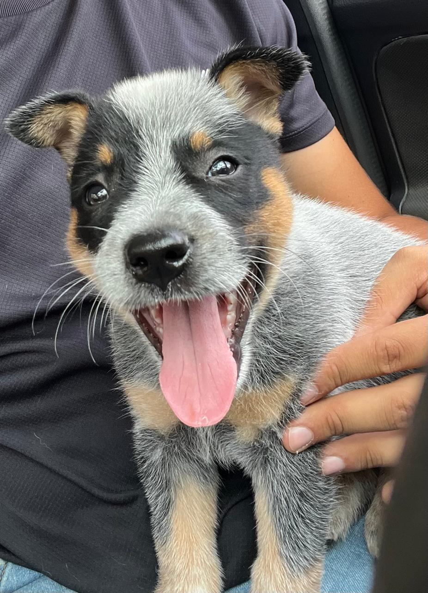

<h2 align="left">Hi 👋! My name is Brenno Dornelas. I'm a Computer Science student from Brazil, exploring a bit of everything in tech.</h2>

###

###

###

###

<h3 align="left">👩‍💻  About Me</h3>

###

I'm Brenno  from Brazil  - 🔭 I’m studying Computer Science in my second semester - 📚 I'm currently learning Arduino, Python, and core programming fundamentals. - ⚡ In my free time I enjoy reading and spending time outdoors.

###

<h3 align="left">🛠 Language and tools</h3>

###

  
  
  
  
  
  
  
  
  
  
  
  
  

###

  

  

  

  

###
